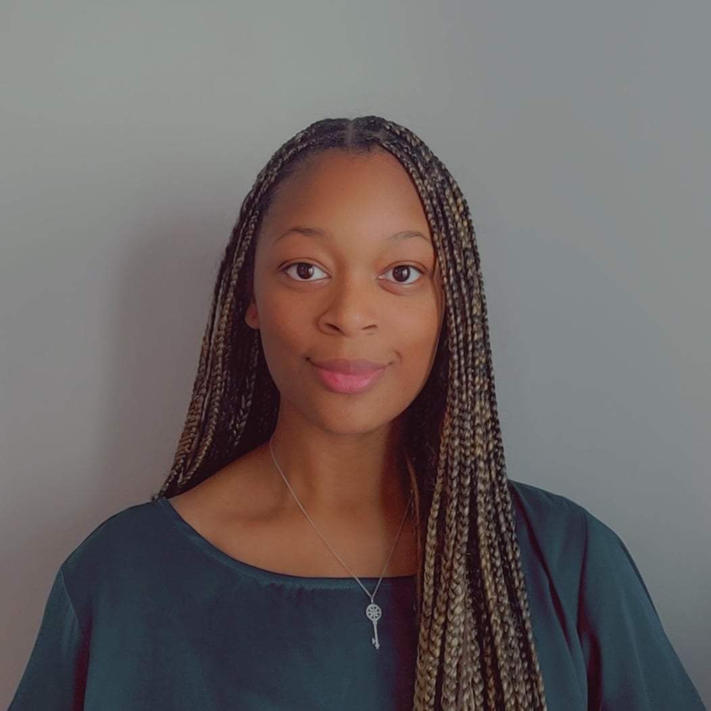

  
  

## Education 

### :woman_student: Rice University - Master's of Engineering Management & Leadership '26
**Specialization in Data Science**

### :woman_student: Rice University - Master's of Computational and Applied Mathematics '24

### :woman_student: Embry-Riddle Aeronautical University - Bachelor of Science in Computational Mathematics '22
**Minors in Astronomy/Astrophysics and Humanities**

## Professional Experience

### The Boeing Company - Electrophysics Engineer and Scientist 2024
- Conducting Integration and Testing analysis for the electronics within the F/A-18 Super Hornet jet along with supporting the Mission Systems teams

## Examples
- [calbertiboms.github.io](https://calbertiboms.github.io/)
- [sanjanak0203.github.io](https://sanjanak0203.github.io/)
- [nagensk9.github.io](https://nagensk9.github.io/)
- [suryanshu-pugla.github.io](https://suryanshu-pugla.github.io/)
- [GitHub Emoji Cheat Sheet](https://github.com/ikatyang/emoji-cheat-sheet?tab=readme-ov-file#smileys--emotion)
